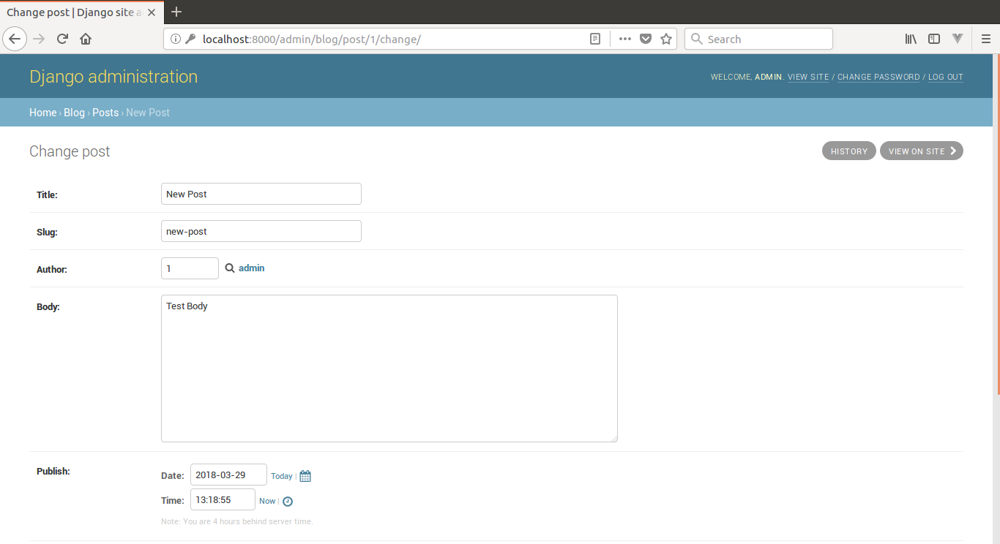
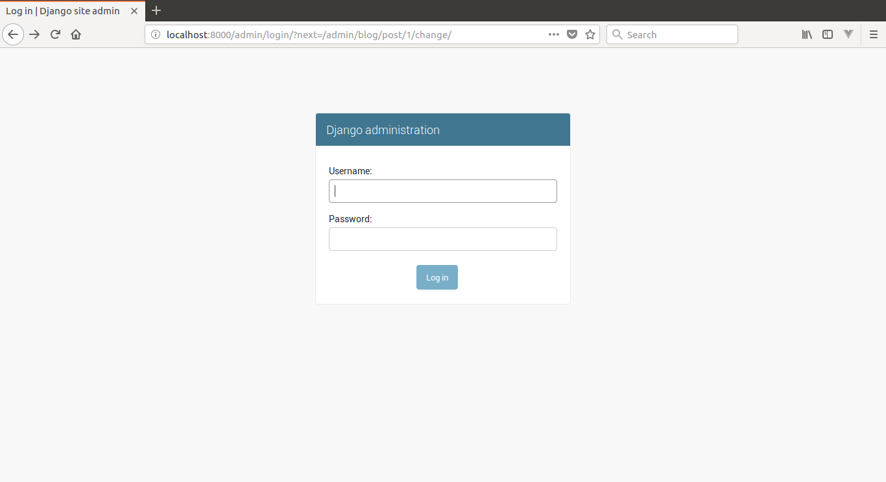

#  Docker Django Postgres
## Personal Blog Demo

Docker Django Postgres Personal Blog Demo is created as a demo project for my portfolio.
If you are interested in hiring me for work please email me at robscodebase@gmail.com.

Unless otherwise noted, these source files are distributed under the
BSD-style license found in the LICENSE file.

### Clone Repo

You must have Docker and Docker-Compose installed on your machine.
* Clone repo.
  * `git clone https://github.com/robscodebase/django-blog.git`

### Run Docker-Compose

* Navigate to /django-blog
  * `sudo docker-compose up`
#### Superuser
  * user: `admin`
  * email: `admin@admin.com`
  * password: `demopass`

### View App

* Open browser and navigate to localhost:8000/

### Included Languages.
* Docker
* Python3
* Django
* Postgres

